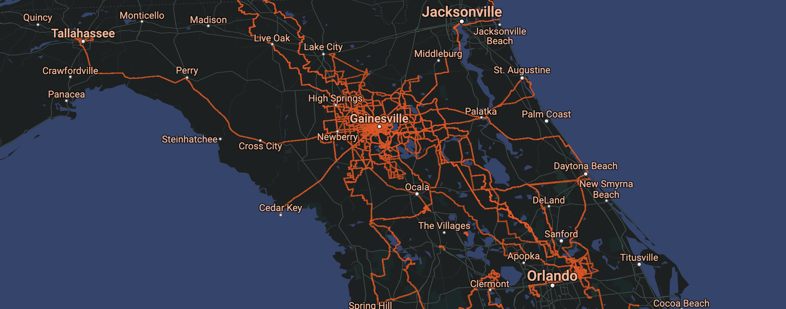

# NEW HEAT

### [Presentation](https://www.instagram.com/p/C9C47Zhs2Af/)

## Credits

- **Dreamt by:** [Me](https://github.com/charlieforward9)
- **Collected with:** [Garmin](https://www.garmin.com) / [Strava](https://www.strava.com/athletes/45046621)
- **Persisted with:** [Strava](https://www.strava.com/athletes/45046621)
- **Processed in:** [Python](https://www.python.org)
- **Filtered with:** [H3](https://h3geo.org)
- **Built in:** [TypeScript](https://www.typescriptlang.org)
- **Framed with:** [React](https://reactjs.org)
- **Mapped with:** [Google Maps](https://maps.google.com)
- **Interleaved with:** [DeckGL](https://deck.gl)
- **Optimized with:** [Million](https://million.dev)
- **Bundled with:** [Vite](https://vitejs.dev)
- **Hosted with:** [GitHub Pages](https://pages.github.com)
- **Versioned with:** [GitHub](https://github.com/charlieforward9/NEW_HEAT)

## Architecture

